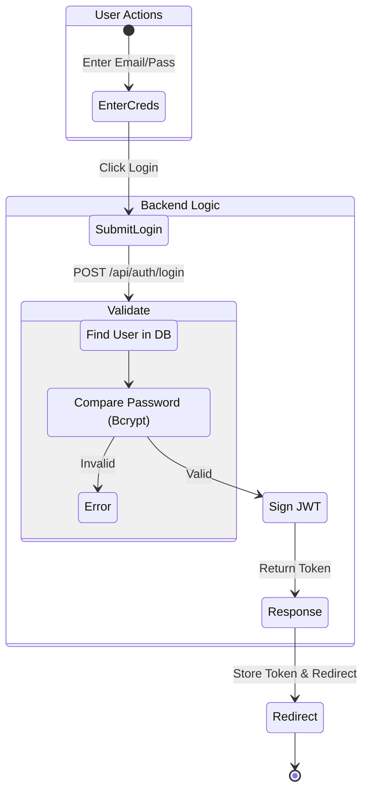
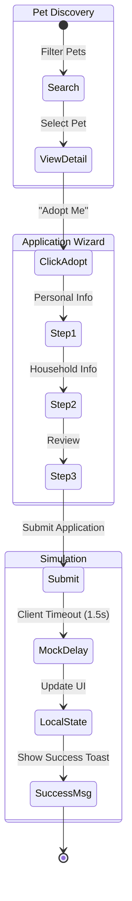
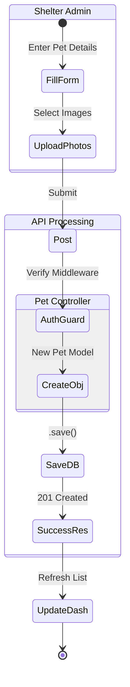
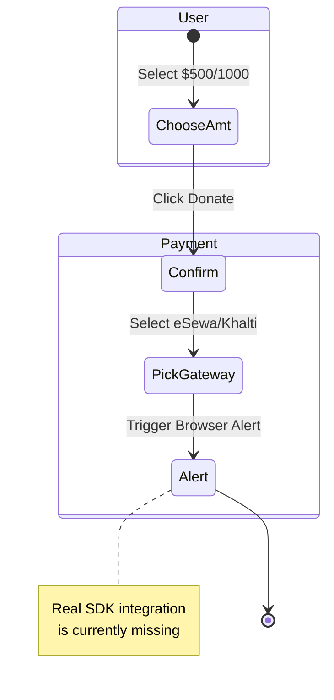

# Comprehensive Activity Diagrams

Detailed activity diagrams split by functional area for readability.

## 1. Authentication Flow (Fully Integrated)
*Status: Backend Fully Implemented*

## 2. Adoption Process (Frontend Simulation)
*Status: Frontend Mock Only (Logic Gap)*

## 3. Shelter Operations (Fully Integrated)
*Status: Backend Fully Implemented*

## 4. Donation Flow (Frontend Simulation)
*Status: Payment Integration Pending*

