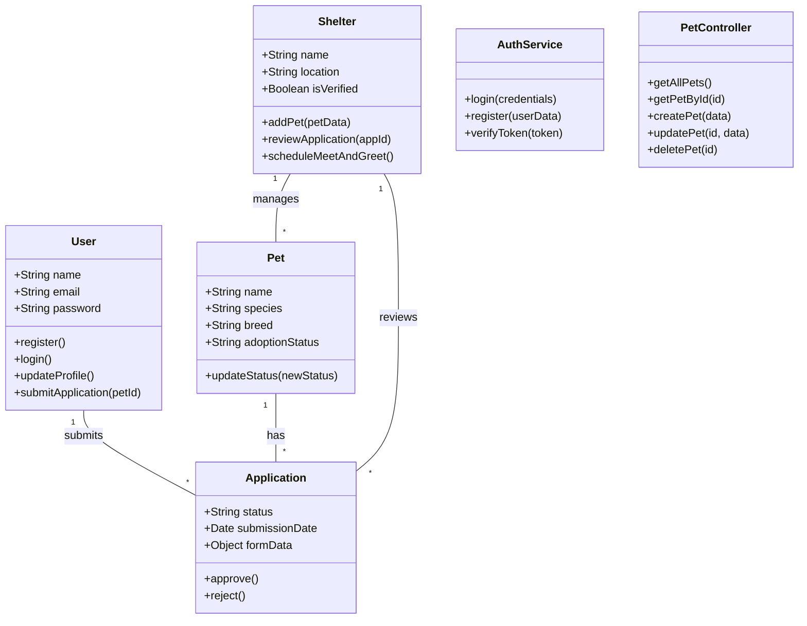

# Class and Use Case Diagrams

This document contains the structural and behavioral design diagrams.

## 1. Use Case Diagram
This diagram illustrates the primary actors and their interactions with the system.

```mermaid
usecaseDiagram
    actor "Adopter" as Adopter
    actor "Shelter Admin" as Shelter
    actor "System Admin" as Admin

    package "PetMate System" {
        usecase "Search Pets" as UC1
        usecase "View Pet Details" as UC2
        usecase "Submit Adoption Request" as UC3
        usecase "Donate" as UC4
        usecase "Manage Profile" as UC5
        
        usecase "Manage Pet Inventory" as UC6
        usecase "Review Applications" as UC7
        usecase "Schedule Meet & Greet" as UC8
        usecase "Manage Shelter Settings" as UC9
        
        usecase "Manage Shelters" as UC10
        usecase "Global Pet Oversight" as UC11
    }

    Adopter --> UC1
    Adopter --> UC2
    Adopter --> UC3
    Adopter --> UC4
    Adopter --> UC5

    Shelter --> UC6
    Shelter --> UC7
    Shelter --> UC8
    Shelter --> UC9

    Admin --> UC10
    Admin --> UC11
    Admin --> UC6
```

## 2. Class Diagram
This diagram represents the static structure of the system's classes and their attributes/methods.


