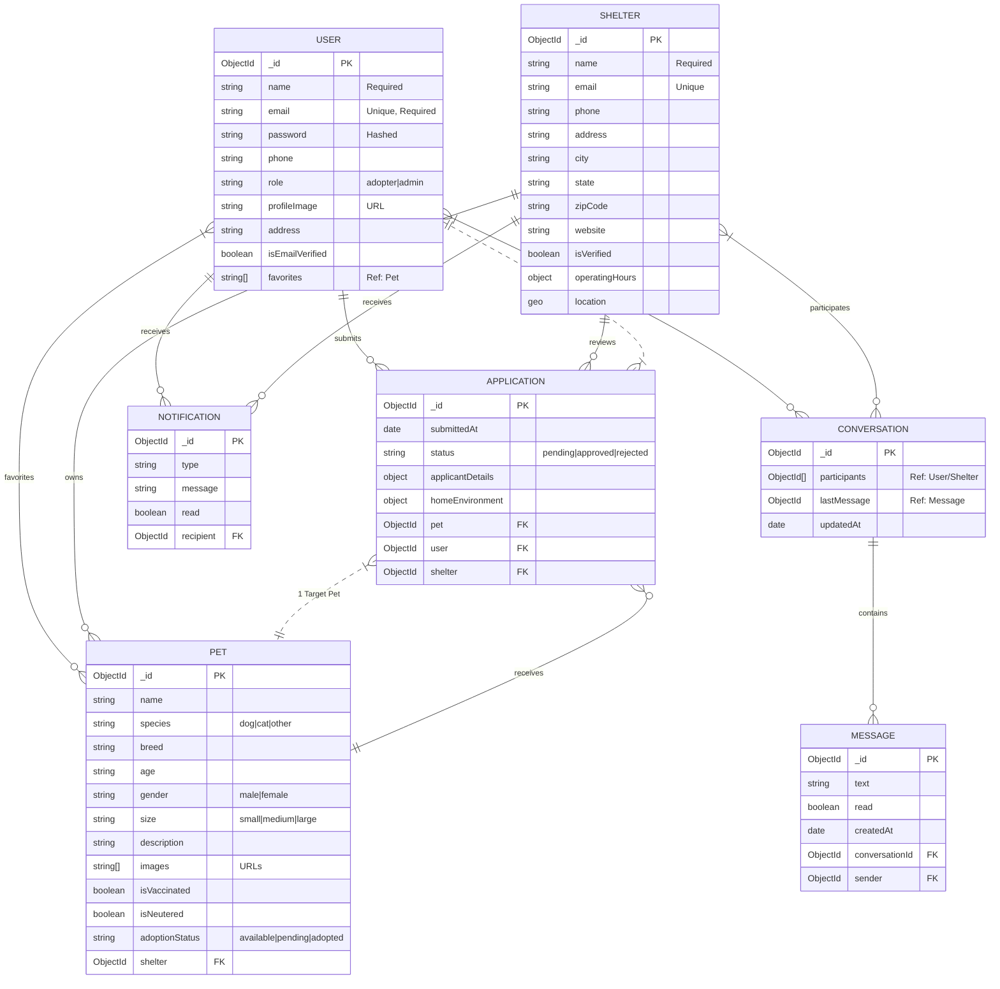

# Detailed Entity-Relationship (ER) Diagram

This diagram represents the detailed data schema and relationships of the PetMate system, based on the backend Mongoose models.

## Key Improvements
1.  **Full Attribute List:** Added specific fields like `isVaccinated`, `operatingHours`, and `adoptionStatus` derived from the source code.
2.  **Cardinality:** Explicitly marked `1-to-many` (||--o{) and `many-to-many` relationships.
3.  **Logical Entities:** Included `APPLICATION` which connects Users, Pets, and Shelters, essentially acting as the central transaction record.
