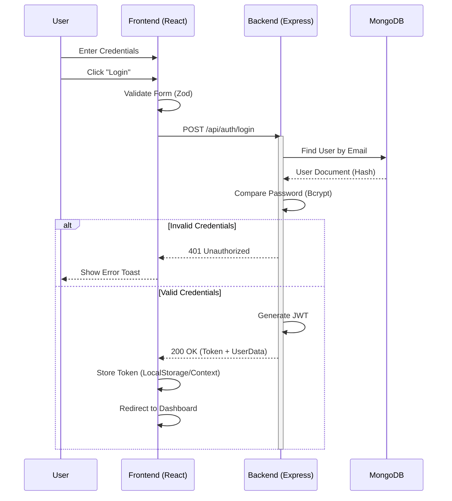
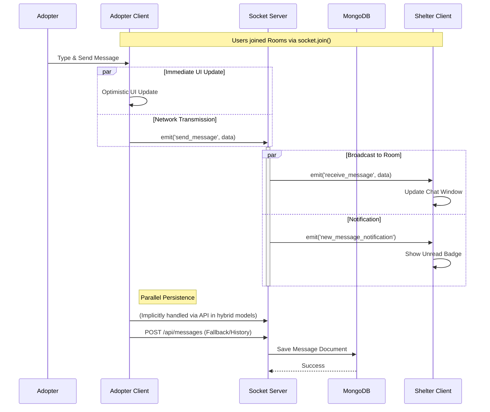
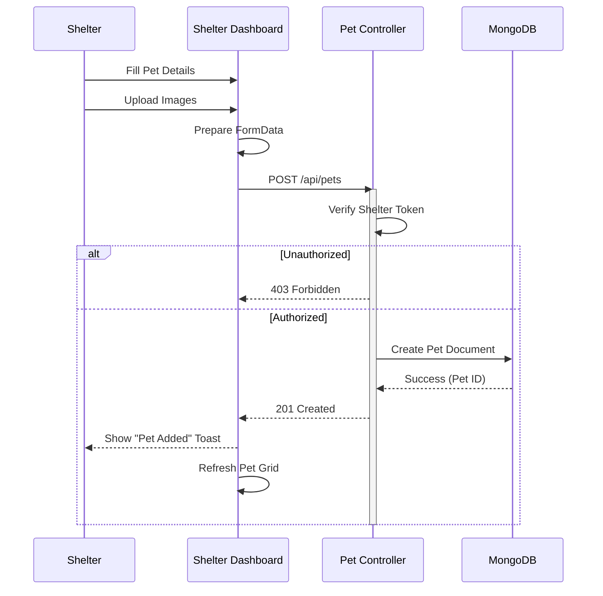
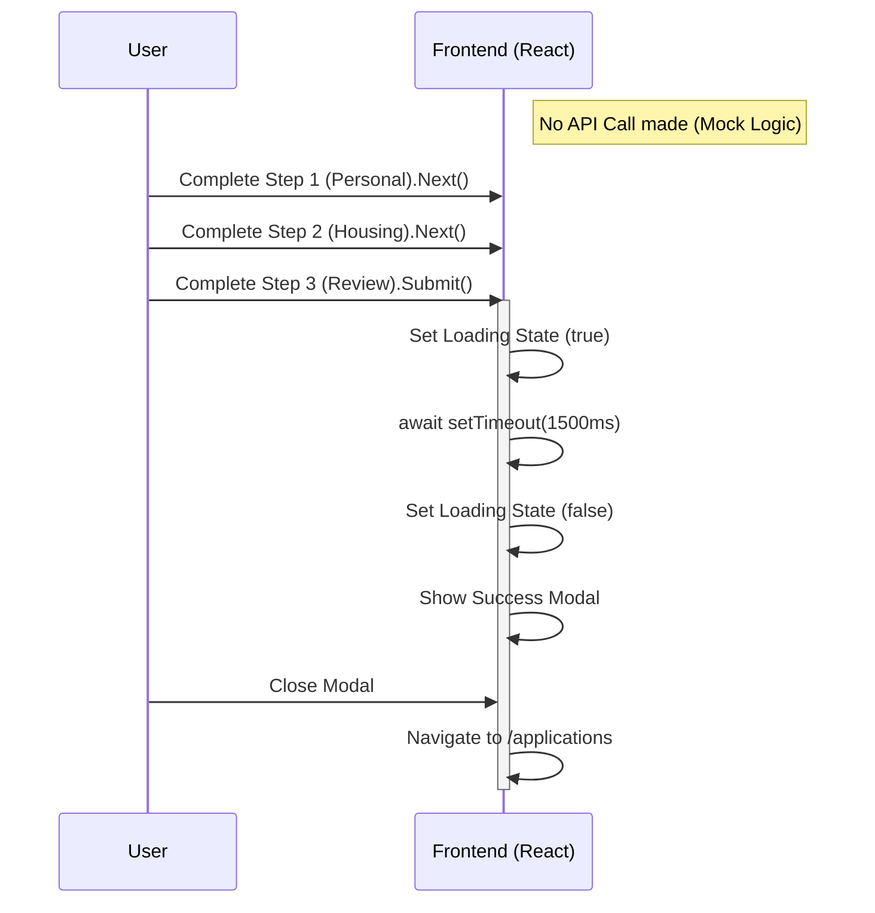

# Detailed Sequence Diagrams

This document illustrates the precise sequential interactions between system components.
Flows are categorized by their implementation status to ensure accuracy.

## 1. Authentication Process (Fully Implemented)
**Scenario:** User logs into the system.

## 2. Real-Time Messaging (Fully Implemented)
**Scenario:** Adopter sends a message to a Shelter.
**Tech Stack:** Socket.IO + REST Fallback.

## 3. Shelter Pet Management (Fully Implemented)
**Scenario:** Shelter adds a new pet to the system.

## 4. Adoption Request (Frontend Simulation)
**Scenario:** User applies to adopt a pet.
**Status:** Backend logic is currently mocked on the client side.

