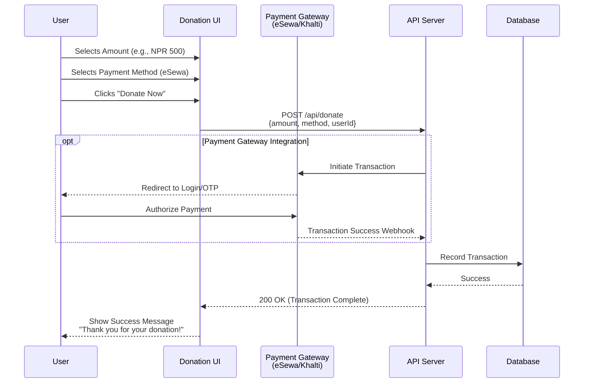
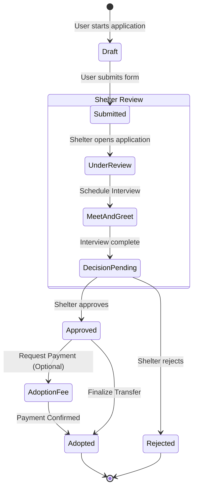
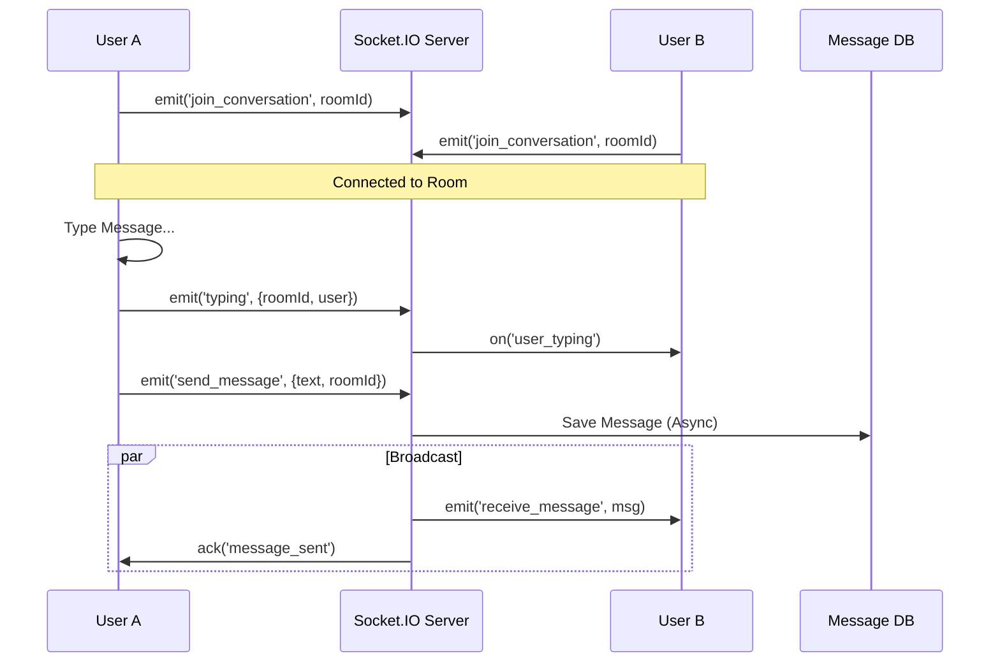

# PetMate System Workflows

This document details the operational workflows of the PetMate application.

## 1. Donation Service Workflow
PetMate allows users to support shelters through monetary donations.



## 2. Adoption Request Lifecycle
The core feature of PetMate is the adoption process.



## 3. User Authentication Flow
Secure entry points for Adopters and Shelters.

```mermaid
flowchart TD
    Start([User Visits Site]) --> CheckAuth{Is Logged In?}
    
    CheckAuth -- Yes --> RedirectDash[Redirect to Dashboard<br>(Based on Role)]
    CheckAuth -- No --> Landing[Landing Page]
    
    Landing --> LoginClick[Click Login]
    LoginClick --> LoginForm[Login Page]
    
    LoginForm --> InputCreds[Enter Email/Pass]
    InputCreds --> SubmitLogin[Submit]
    
    SubmitLogin --> VerifyCreds{Valid Credentials?}
    
    VerifyCreds -- No --> ErrorMsg[Show Error]
    ErrorMsg --> InputCreds
    
    VerifyCreds -- Yes --> GetProfile[Fetch User Profile]
    
    GetProfile --> CheckVerified{Email Verified?}
    
    CheckVerified -- No --> VerifyPage[Redirect to Verification]
    CheckVerified -- Yes --> RoleCheck{Role?}
    
    RoleCheck -- "Adopter" --> Home[Home Page]
    RoleCheck -- "Shelter" --> SheltDash[Shelter Dashboard]
    RoleCheck -- "Admin" --> AdminDash[Admin Dashboard]
```

## 4. Real-Time Communication
Chat functionality between Adopters and Shelters.


