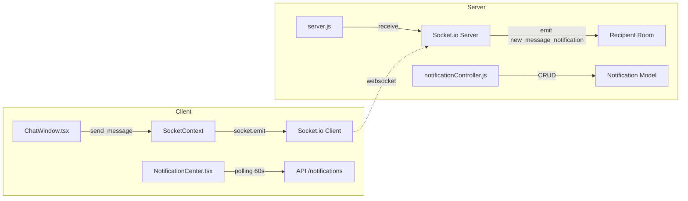
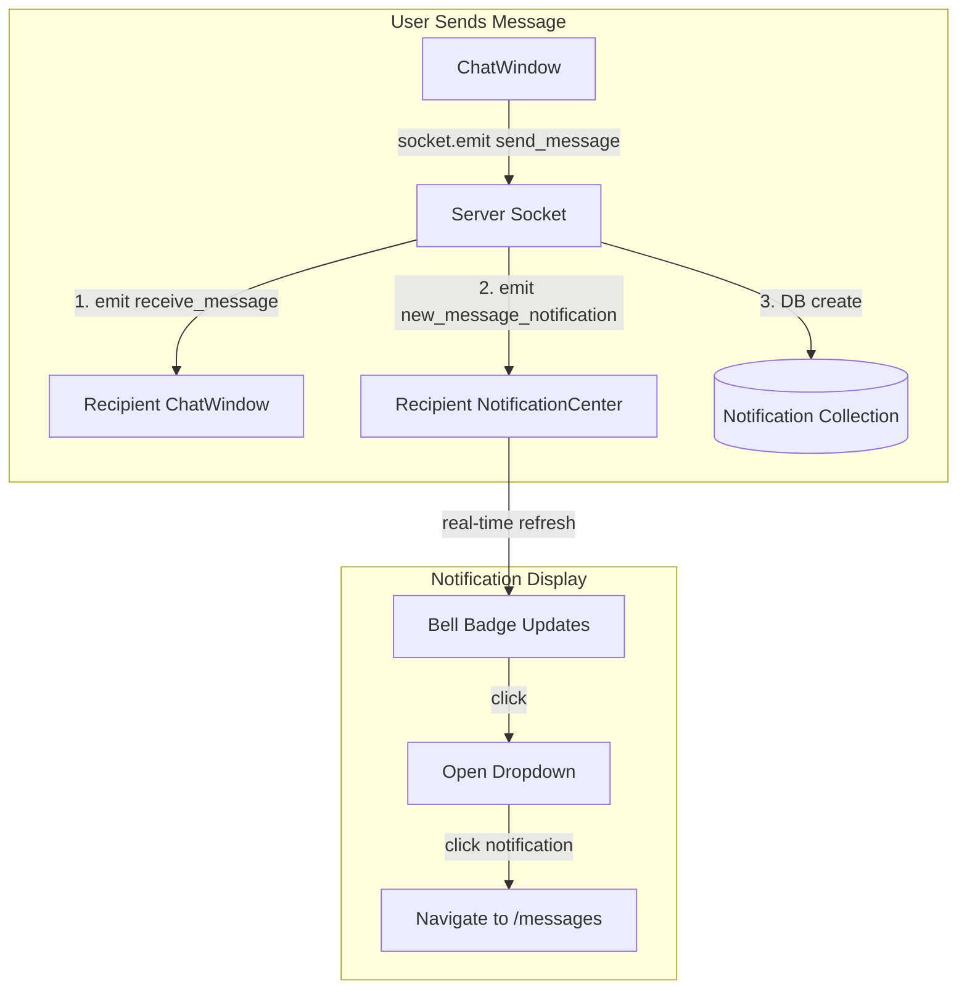

# Message Notification Integration

## Goal
When someone sends a message, create a notification in the database that appears in the NotificationCenter bell icon, with real-time delivery via Socket.io.

## Current Architecture



### What's Already Working
1. **Socket.io Events**: Server already emits `new_message_notification` to recipient's room (line 67-72 in `server.js`)
2. **Notification Model**: Supports types: 'info', 'success', 'warning', 'error', 'system', 'application', 'pet'
3. **NotificationCenter**: Polls every 60s, shows bell icon with unread count badge
4. **Socket Connection**: Users join their room on connect (`join_user` event)

### What's Missing
1. ❌ No 'message' type in Notification model
2. ❌ Server doesn't create DB notification when message is sent
3. ❌ NotificationCenter doesn't listen for real-time socket events
4. ❌ No link to navigation when clicking message notification

---

## Proposed Changes

### Backend Changes

#### [MODIFY] [Notification.js](file:///c:/game/continue/PetMate2/server/models/Notification.js)
Add 'message' type to the enum:
```diff
  type: {
    type: String,
-   enum: ['info', 'success', 'warning', 'error', 'system', 'application', 'pet'],
+   enum: ['info', 'success', 'warning', 'error', 'system', 'application', 'pet', 'message'],
    default: 'info'
  },
```

---

#### [MODIFY] [server.js](file:///c:/game/continue/PetMate2/server/server.js)
When handling `send_message` event, also create a persistent notification in the database:
```javascript
// In send_message handler:
socket.on("send_message", async (data) => {
  // ... existing socket emit code ...
  
  // Create persistent notification in DB
  await Notification.create({
    recipient: data.recipientId,
    type: 'message',
    title: 'New Message',
    message: `${data.senderName}: ${data.text.substring(0, 50)}${data.text.length > 50 ? '...' : ''}`,
    relatedLink: `/messages?conversation=${data.conversationId}`
  });
});
```

> [!IMPORTANT]
> Need to import Notification model in server.js

---

### Frontend Changes

#### [MODIFY] [NotificationCenter.tsx](file:///c:/game/continue/PetMate2/client/src/components/NotificationCenter.tsx)
1. Add socket listener for real-time notifications
2. Add 'message' icon type (MessageCircle icon)
3. Refresh notifications when socket event received

```javascript
// Add socket listener inside useEffect:
useEffect(() => {
  if (!socket) return;
  
  const handleNewNotification = () => {
    fetchNotifications(); // Refresh from API
  };
  
  socket.on('new_message_notification', handleNewNotification);
  
  return () => {
    socket.off('new_message_notification', handleNewNotification);
  };
}, [socket]);
```

---

#### [MODIFY] [ChatWindow.tsx](file:///c:/game/continue/PetMate2/client/src/components/messaging/ChatWindow.tsx)
Update the `send_message` socket emit to include sender's name for notification:
```javascript
socket.emit('send_message', {
  conversationId,
  senderId: currentUserId,
  senderName: user?.name,  // Add this
  recipientId: otherUser?._id,
  text: newMessage
});
```

---

## Updated Architecture



---

## Verification Plan

### Manual Testing
1. **Open two browser windows** (or incognito mode) logged in as different users
2. **User A sends a message to User B**
3. **Verify on User B's screen:**
   - Bell icon badge count increases immediately (real-time)
   - Clicking bell shows notification with "New Message: [preview]"
   - Clicking notification navigates to messages page
4. **Verify persistence:** Refresh User B's page - notification should still appear

### Browser Developer Tools Check
- Open Network tab and verify `/api/notifications` is called when socket event is received
- Check Console for any socket connection errors

---

## User Review Required

> [!IMPORTANT]
> Please confirm the `relatedLink` format. Should it be:
> - `/messages?conversation=<id>` (query param)
> - `/shelter/messages/<id>` (path param for shelters)
> - Something else based on your routing setup?
