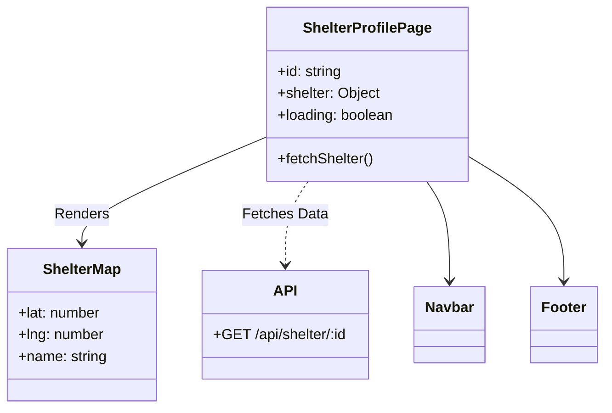
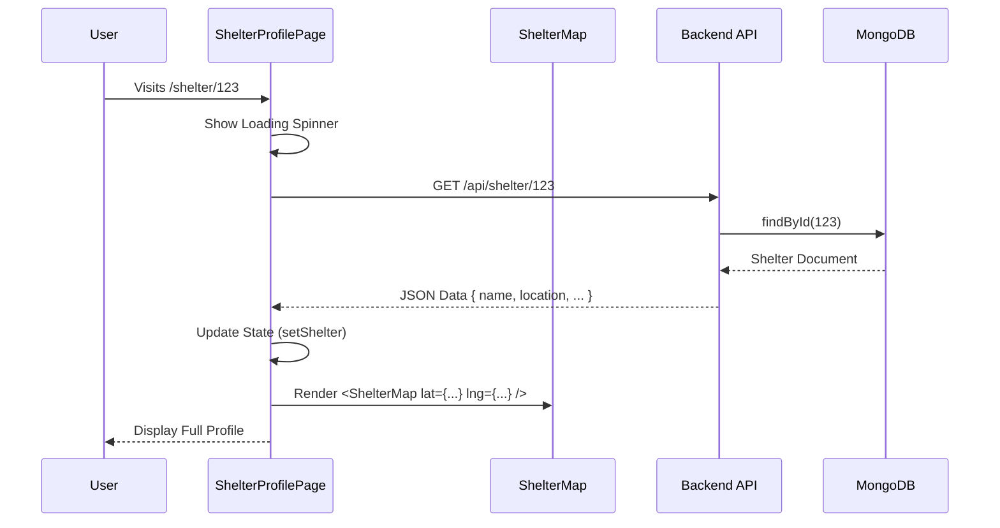

# Shelter Profile Revamp & Location Integration

## Overview
We have significantly overhauled the **Shelter Profile Page** (`/shelter/:id`) to transition from mock data to real, database-driven content. The new design ensures that users see accurate information, including the shelter's real-time location on an interactive map.

## Key Changes

### 1. Real Data Integration
*   **Legacy**: Previously used `mockShelters` array with hardcoded data.
*   **Update**: Now fetches data dynamically from the backend API (`/api/shelter/:id`).
*   **Backend**: Added a new **public** endpoint `getShelterById` to allow any user (logged in or guest) to view shelter details.

### 2. Interactive Map (`ShelterMap`)
*   **Component**: Created a new `ShelterMap.tsx` component using `react-leaflet`.
*   **Functionality**: Displays the shelter's specific coordinates (stored in MongoDB as `location: { lat, lng }`) with a pinned marker.
*   **Read-Only**: Unlike the `LocationPicker`, this map is read-only, designed purely for display.

### 3. User Communication
*   **Message Button**: Added a direct "Message Shelter" button that opens the user's default email client (`mailto:`).
*   **Website Removal**: Removed the generic "Visit Website" button to focus on direct engagement through the platform or email.

### 4. Visual Consistency
*   **Theming**: Refactored the entire page to use **CSS Variables** (`var(--color-primary)`, `var(--color-surface)`, etc.) instead of hardcoded Hex values. This ensures full compatibility with the new **Theme System** and **Dark Mode**.

---

## Technical Architecture

### Component Structure
The following diagram illustrates how the `ShelterProfilePage` is composed and its dependencies.



### Data Flow
This sequence diagram shows the lifecycle of the Shelter Profile page load.



## Backend Implementation Details

**File**: `server/controllers/shelterController.js`
```javascript
// New Public Endpoint
export const getShelterById = async (req, res) => {
  try {
    const shelter = await Shelter.findById(req.params.id)
        .select("-password -documentation -preferences");
    // ... handles not found & errors
    res.json(shelter);
  } catch (error) { ... }
};
```

**File**: `server/routes/shelterRoutes.js`
```javascript
// Route Definition
// Placed AFTER specific routes like /me if necessary, or handled carefully
router.get("/:id", getShelterById); 
```
